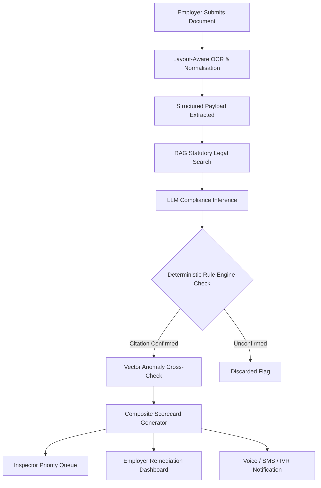

# SHRAM SATHI
## AI-Powered, Inclusive Compliance Intelligence for the Shram Suvidha Ecosystem


---

### Project Overview & Attribution

| Parameter | Specification |
| :--- | :--- |
| **Event** | DIGITAL SHRAM SANKALP - IDEATHON 2026 |
| **Organiser** | Ministry of Labour & Employment, Government of India |
| **Team Name** | Vision Buddies |
| **Team Members** | Manasvi Gangrade (Team Lead), Suhani Sharma, Muskan Lodhi, Tanish Mahajan |
| **Institution** | Indore Institute of Science and Technology |
| **Primary Problem Statement** | **PS-05**: AI-Driven Smart Inspection System for Labour Code Compliance (Shram Suvidha Portal) |
| **Integrated Highlight** | **PS-06**: Accessibility & Inclusive Technology, built in as a core design layer, not an add-on |
| **Focus Platform** | Shram Suvidha Portal 2.0, with interoperability hooks to eShram and National Career Service (NCS) |

---

## Table of Contents

- [1. Executive Summary](#1-executive-summary)
- [2. Introduction & Background](#2-introduction--background)
  - [2.1 Ministry of Labour & Employment - Mandate](#21-ministry-of-labour--employment---mandate)
  - [2.2 The Digital Ecosystem: eShram, NCS, and Shram Suvidha](#22-the-digital-ecosystem-eshram-ncs-and-shram-suvidha)
  - [2.3 Why the Four Labour Codes Matter Here](#23-why-the-four-labour-codes-matter-here)
- [3. Problem Statement & Motivation](#3-problem-statement--motivation)
  - [3.1 Understanding PS-05](#31-understanding-ps-05)
  - [3.2 The Scale of the Compliance Gap](#32-the-scale-of-the-compliance-gap)
  - [3.3 Why the Current Portal Experience Falls Short](#33-why-the-current-portal-experience-falls-short)
- [4. Related Work & Existing Government Initiatives](#4-related-work--existing-government-initiatives)
  - [4.1 Shram Suvidha Portal 2.0](#41-shram-suvidha-portal-20)
  - [4.2 Shram Pehchan Sankhya and Risk-Based Inspection](#42-shram-pehchan-sankhya-and-risk-based-inspection)
  - [4.3 The Gap Shram Sathi Addresses](#43-the-gap-shram-sathi-addresses)
- [5. Proposed Solution: Shram Sathi](#5-proposed-solution-shram-sathi)
  - [5.1 Vision & Core Idea](#51-vision--core-idea)
  - [5.2 Key Modules Overview](#52-key-modules-overview)
- [6. Technical Architecture](#6-technical-architecture)
  - [6.1 System Layers](#61-system-layers)
  - [6.2 Why an LLM Alone Is Not Enough](#62-why-an-llm-alone-is-not-enough)
  - [6.3 Data Flow Summary](#63-data-flow-summary)
- [7. Special Highlight: PS-06 Accessibility & Inclusion Layer](#7-special-highlight-ps-06-accessibility--inclusion-layer)
  - [7.1 Voice-First Interaction](#71-voice-first-interaction)
  - [7.2 Multilingual Support (240+ Languages)](#72-multilingual-support-240-languages)
  - [7.3 Icon-Driven, Simplified Interface](#73-icon-driven-simplified-interface)
  - [7.4 Disability-Inclusive Design](#74-disability-inclusive-design)
  - [7.5 Low-Tech Fallbacks](#75-low-tech-fallbacks)
- [8. Data Security & Privacy Framework](#8-data-security--privacy-framework)
  - [8.1 Alignment with the DPDP Act, 2023](#81-alignment-with-the-dpdp-act-2023)
  - [8.2 Technical Safeguards](#82-technical-safeguards)
  - [8.3 Consent Architecture](#83-consent-architecture)
- [9. Feasibility & Implementability](#9-feasibility--implementability)
- [10. Impact & Benefits](#10-impact--benefits)
  - [10.1 For Workers](#101-for-workers)
  - [10.2 For Employers & MSMEs](#102-for-employers--msmes)
  - [10.3 For Inspectors and the Ministry](#103-for-inspectors-and-the-ministry)
- [11. Sustainability & Long-Term Value](#11-sustainability--long-term-value)
- [12. Alignment with Evaluation Criteria](#12-alignment-with-evaluation-criteria)
- [13. Conclusion](#13-conclusion)
- [14. Local Installation & Development](#14-local-installation--development)

---

## 1. Executive Summary

Shram Sathi is an AI-driven compliance intelligence layer designed to sit on top of the existing Shram Suvidha Portal 2.0. It reads employer-submitted compliance documents - typed PDFs, scanned images, or photographed forms - interprets them against the requirements of India's four Labour Codes, automatically flags missing fields, anomalies, and non-compliance risks, and generates a Risk-Based Compliance Scorecard for every establishment.

What makes Shram Sathi distinct is that it does not treat accessibility as an afterthought. Every core interaction - checking a scorecard, receiving an alert, submitting a clarification - is available through voice, in regional languages, and through low-tech channels like SMS/IVR, directly answering PS-06 (Accessibility & Inclusive Technology) as a built-in property of the PS-05 solution rather than a separate feature bolted on later.

> [!NOTE]
> Shram Sathi operates as an intelligent microservice layer alongside Shram Suvidha Portal 2.0. It requires zero destructive migration and reuses the existing LIN (Labour Identification Number) foundation.

---

## 2. Introduction & Background

### 2.1 Ministry of Labour & Employment - Mandate
The Ministry of Labour & Employment (MoLE) is responsible for protecting and promoting the interests of workers across India's organised and unorganised sectors. Its digital modernisation roadmap rests on the Four Labour Codes:
1. **Code on Wages, 2019**
2. **Industrial Relations Code, 2020**
3. **Code on Occupational Safety, Health and Working Conditions (OSH & WC), 2020**
4. **Code on Social Security, 2020**

Together, these codes replace 29 older central labour enactments with a simplified, unified statutory framework.

### 2.2 The Digital Ecosystem: eShram, NCS, and Shram Suvidha
- **eShram**: India's primary national database of unorganised workers (migrant, construction, agricultural, domestic, and platform workers), with over 31.82 crore registered workers and 15 social security and welfare schemes integrated through a 12-digit Universal Account Number (UAN).
- **National Career Service (NCS)**: A technology-driven employment portal covering 3,000+ occupations across 53 industry sectors, providing job matching, skill-gap analysis, and employment facilitation.
- **Shram Suvidha Portal 2.0**: A unified statutory interface for registration, licensing, inspections, and annual returns, supporting auto-registration, single annual returns, and risk-based inspection scheduling.

### 2.3 Why the Four Labour Codes Matter Here
The 2020 Labour Codes deliberately move India's compliance regime toward a risk-based, technology-enabled inspection model rather than blanket manual inspection of every establishment. This policy shift is exactly the gap Shram Sathi is built to serve - it gives the Ministry the AI layer needed to make risk-based inspection genuinely intelligent, rather than randomly assigned.

---

## 3. Problem Statement & Motivation

### 3.1 Understanding PS-05
PS-05 poses the foundational challenge:
> How can AI-enabled technologies and automated document-reading tools analyse compliance documents (PDFs, scanned images), interpret Labour Code requirements, flag anomalies and missing fields, alert employers and inspector-cum-facilitators, and generate a risk-based compliance scorecard?

### 3.2 The Scale of the Compliance Gap
Independent analysis of DGFASLI (Directorate General Factory Advice Service and Labour Institutes) records reveals a structural inspection challenge:

```text
DGFASLI Inspection Coverage Trajectory:
Year 2005: [============================== 47.56% ]
Year 2010: [====================== 36.10%        ]
Year 2018: [============== 24.80%               ]
Year 2023: [=========== 19.12%                  ]  <- Critical Deficit
```

- In 2005, 47.56% of inspectable workplaces were inspected.
- By 2023, that figure dropped to only **19.12%**.
- Approximately four out of five inspectable establishments go unchecked annually due to chronic inspector shortages relative to the exponential growth of registered commercial entities.

AI-assisted document reading and automated risk scoring bridges this deficit: by pre-screening 100% of submitted documents, human inspectors can focus on verified high-risk units instead of routine paperwork.

### 3.3 Why the Current Portal Experience Falls Short
- **Document-Heavy Manual Review**: Compliance scrutiny relies on human manual reading of dense tables, which does not scale.
- **Unstructured Submissions**: Scanned and photographed filings from small units suffer from skew, noise, and low resolution.
- **Language and Digital Literacy Barriers**: Existing interfaces assume high digital literacy and English fluency, excluding small workshops and micro-enterprises who fail compliance out of procedural unfamiliarity rather than malice.

---

## 4. Related Work & Existing Government Initiatives

### 4.1 Shram Suvidha Portal 2.0
Shram Suvidha 2.0 provides unified registration, licensing, Single All-India Licences for multi-state operations, and consolidated annual returns. Shram Sathi acts as an API-first intelligence microservice that plugs directly into this system.

### 4.2 Shram Pehchan Sankhya and Risk-Based Inspection
The Ministry introduced the Unique Labour Identification Number (Shram Pehchan Sankhya / LIN) along with computerized inspection schemes that assign inspection targets. Shram Sathi enhances this by replacing random selection with multi-variable statutory risk scoring.

### 4.3 The Gap Shram Sathi Addresses
Existing portals simplify filing. Shram Sathi introduces the automated verification layer after submission, coupled with universal accessibility so any citizen can understand their compliance status.

---

## 5. Proposed Solution: Shram Sathi

### 5.1 Vision & Core Idea
Shram Sathi ingests employer submissions, parses them against the four Labour Codes, notifies employers of anomalies in their native language and format, and supplies inspectors with an evidence-backed priority queue.

### 5.2 Key Modules Overview

```text
+-----------------------------------------------------------------------------+
|                                SHRAM SATHI                                  |
|                                                                             |
|  [Module 1] Document Ingestion & Optical Character Recognition (OCR)        |
|  [Module 2] Retrieval-Augmented Generation (RAG) Statutory Compliance LLM  |
|  [Module 3] Deterministic Legal Rule Engine Safety Net                      |
|  [Module 4] Historical Filing Sector-Level Anomaly Detection               |
|  [Module 5] Dynamic Risk-Based Compliance Scorecard (0-100 Composite)      |
|  [Module 6] Universal Accessibility, Voice & Low-Tech Fallback (PS-06)      |
|  [Module 7] DPDP Act 2023 Privacy & Sovereign Cryptographic Vault           |
+-----------------------------------------------------------------------------+
```

---

## 6. Technical Architecture

### 6.1 System Layers

| Layer | System Component | Technical Functionality |
| :--- | :--- | :--- |
| **Layer 1** | Ingestion Pipeline | Accepts PDF, scanned image, or camera uploads via Shram Suvidha submission flows. |
| **Layer 2** | OCR & Field Normaliser | Layout-aware vision parsing normalises skewed, noisy files into structured schema. |
| **Layer 3** | Compliance Interpretation | LLM grounded via RAG on statutory clauses checks extracted fields against codes. |
| **Layer 4** | Rule Engine Safety Net | Deterministic validation: every AI flag must tie to a verifiable statutory clause. |
| **Layer 5** | Anomaly Detection | Vector similarity search over anonymised historical filings flags statistical outliers. |
| **Layer 6** | Scorecard Engine | Synthesises rule flags and anomaly metrics into a Low / Medium / High score. |
| **Layer 7** | Multi-Channel Delivery | Delivers insights via Web Dashboards, Voice TTS/STT, SMS, and IVR gateways. |

### 6.2 Why an LLM Alone Is Not Enough
An unconstrained generative model can hallucinate citations or produce plausible-sounding misinterpretations of the law. In statutory enforcement, a false accusation or missed violation carries legal ramifications. 

Shram Sathi uses a dual-engine safeguard:
1. **The LLM acts as an extraction and parsing assistant.**
2. **The deterministic rule engine validates every flag against exact statutory clauses before display.**

```
Submitted File -> Layout OCR -> Structured Fields -> RAG LLM -> Rule Engine -> Verified Flag
                                                                     |
                                                              [Failed Section?]
                                                                     v
                                                            Discarded / Suppressed
```

### 6.3 Data Flow Summary



---

## 7. Special Highlight: PS-06 Accessibility & Inclusion Layer

Accessibility is integrated as a core architectural property of Shram Sathi, ensuring no employer or worker is excluded by literacy or device constraints.

### 7.1 Voice-First Interaction
- **Speech-to-Text (STT)**: Employers and inspectors query system status using spoken natural language.
- **Text-to-Speech (TTS)**: The system speaks compliance findings, scorecards, and remedial steps aloud.
- **Inspector Field Dictation**: Inspectors record on-site inspection notes via voice, automatically transcribed and tagged with statutory code references.

### 7.2 Multilingual Support (240+ Languages)
- Real-time native language switcher providing 240+ global and regional languages.
- Full native select integration with automatic speech-synthesis voice localization.
- Complete coverage across Eighth Schedule Indian languages including Hindi, Tamil, Telugu, Bengali, Marathi, Gujarati, Kannada, Malayalam, Odia, Punjabi, and Assamese.

### 7.3 Icon-Driven, Simplified Interface
- Low-literacy mode transforms complex legal text into intuitive colour-coded visual cards (Green = Compliant, Amber = Attention Needed, Red = Critical Risk).
- Single-sentence plain-language summaries remove legal jargon.

### 7.4 Disability-Inclusive Design
- **WCAG 2.1 AA Compliance**: High-contrast modes, clear semantic tags, and screen-reader optimizations.
- **Dyslexia-Friendly Typography**: Universal toggle applying Atkinson Hyperlegible typography with tailored character spacing.
- **Focus & Spotlight Mode**: Lowers background distractions to assist users with cognitive or attention-related needs.
- **Reduced Motion**: Instant toggle to pause marquees, animations, and transitions for vestibular safety.

### 7.5 Low-Tech Fallbacks
- **SMS Gateway**: Automated text summaries dispatched to standard feature phones.
- **Interactive Voice Response (IVR)**: Toll-free 1800-SHRAM-SATHI phone gateway allowing compliance checks via standard telephone keypads.

---

## 8. Data Security & Privacy Framework

### 8.1 Alignment with the DPDP Act, 2023
Shram Sathi is built around the Digital Personal Data Protection Act, 2023:
- **Data Fiduciary**: Ministry of Labour & Employment / Shram Suvidha Portal.
- **Data Processor**: Shram Sathi compliance intelligence engine.
- **Data Principal**: Registered employer or unorganised worker.

Principals maintain clear statutory rights to access, rectification, and erasure of submitted documentation.

### 8.2 Technical Safeguards
- **Encryption Standards**: AES-256 encryption at rest; TLS 1.3 encryption in transit.
- **Data Minimisation & Anonymisation**: Cross-establishment anomaly detection operates exclusively on anonymised, hashed records with zero exposure of worker PII.
- **Immutable Audit Logging**: Every compliance judgment logs an audit trail linking the document hash, timestamp, engine version, and legal clause.

### 8.3 Consent Architecture
Document ingestion requires explicit, purpose-limited digital consent displayed in the employer's preferred language, with clear notices on data usage.

---

## 9. Feasibility & Implementability

- **API-First Architecture**: Connects to Shram Suvidha 2.0 without requiring platform redesign.
- **Phased Rollout**: Structured for initial piloting across industrial clusters (e.g., Peenya, Okhla, Sanand) before nationwide deployment.
- **Identifier Reuse**: Natively operates on existing Shram Pehchan Sankhya (LIN) and eShram UAN structures.
- **Mature Technology Stack**: Utilises established, production-tested OCR and search standards.

---

## 10. Impact & Benefits

### 10.1 For Workers
- Immediate detection of wage shortfalls, overtime non-payment, and unremitted social security contributions.
- Equal access to safety records for migrant and unorganised workers through multilingual voice services.

### 10.2 For Employers & MSMEs
- Self-remediation tools to resolve non-compliance before formal notices are issued.
- Reduced reliance on private legal intermediaries for routine filing checks.

### 10.3 For Inspectors and the Ministry
- Elimination of blind, random inspections; human resources target verified high-risk units.
- Macro-level intelligence views identifying geographic and sectoral violation clusters.

---

## 11. Sustainability & Long-Term Value

- **Self-Improving Baseline**: Larger filing volumes continually refine anomaly detection accuracy.
- **Low Marginal Processing Cost**: Ingestion cost per document remains near-zero compared to manual human review.
- **Legislative Extensibility**: Updates to statutory rules require corpus updates rather than code rewrites.
- **National Interoperability**: Engineered to cross-reference workforce declarations against eShram databases and NCS vacancy records.

---

## 12. Alignment with Evaluation Criteria

| Evaluation Criterion | Implementation in Shram Sathi |
| :--- | :--- |
| **Relevance to Problem Statement** | Directly fulfills PS-05 requirements with an embedded PS-06 accessibility architecture. |
| **Innovation & Originality** | Combines generative document extraction with a deterministic statutory rule engine. |
| **Feasibility & Implementability** | Non-invasive API integration over Shram Suvidha 2.0; reuses established LIN keys. |
| **Impact Potential** | Directly targets the documented inspection deficit (19.12% coverage in 2023). |
| **User Experience & Accessibility** | Multilingual (240+ languages), voice-first STT/TTS, WCAG 2.1 AA, with IVR/SMS fallback. |
| **Data Security & Privacy** | Strict DPDP Act 2023 compliance, AES-256 storage, and TLS 1.3 transit encryption. |
| **Sustainability & Long-Term Value** | Scalable microservice model extensible to future Labour Code amendments. |
| **Clarity of Presentation** | Structured data flow, clause-level traceability, and transparent risk scoring. |

---

## 13. Conclusion

Shram Sathi bridges India's statutory inspection deficit through targeted, practical artificial intelligence built directly onto existing national digital infrastructure. By combining document parsing with deterministic legal validation and universal accessibility, the platform ensures that compliance intelligence is transparent, actionable, and accessible to every citizen, employer, and inspector across India.

---

## 14. Local Installation & Development

### Prerequisites
- Node.js (version 20.x or higher)
- npm or bun

### Setup Steps

```bash
# 1. Clone repository
git clone https://github.com/Manasvi-Gangrade/Shram-Saathi.git

# 2. Enter workspace
cd Shram-Saathi

# 3. Install dependencies
npm install

# 4. Start local development server
npm run dev

# 5. Compile production bundle
npm run build
```

The portal runs locally at `http://localhost:8080/`.

---

*Prepared by Team Vision Buddies for the Digital Shram Sankalp Ideathon 2026, Ministry of Labour & Employment, Government of India.*
